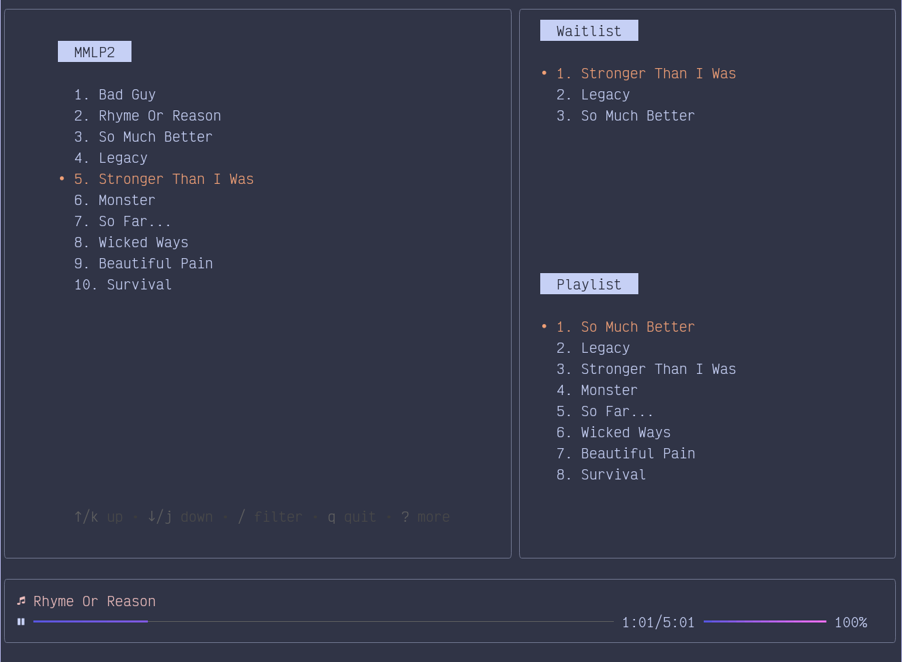

# 🫧 BubbleTube - Bubbletea + YouTube
A TUI youtube music player written in Go with the [bubbletea framework](https://github.com/charmbracelet/bubbletea/)

## 📦 Dependencies

Make sure these are installed before running the app.

- [MPV](https://github.com/mpv-player/mpv) - used for the actual music playback
- [nerd-font](https://github.com/ryanoasis/nerd-fonts) - for icons in the UI

## ✨ Features

- Login with OAuth2
- View/Search/Select users playlists
- Auto-play playlist
- Playback queue
- Navigation + Controls via hotkeys

## 🔧 Usage

On first run you will be prompted to login with your Google account.
This will allow the app to access your playlists and play videos from them.
Subsequent runs will not require re-authentication.
The app should automatically load and display your playlists.

### Keybindings

- `ctrl + q` - Quit
- `Enter` - Select Playlist/Song
- `p` - Play/Pause
- `a` - Add song to queue
- `Left/Right Arrow` - Seek Back/Forward
- `ctrl + Left/Right Arrow` - Next/Previous Song
- `ctrl + Up/Down Arrow` - Volume Up/Down
